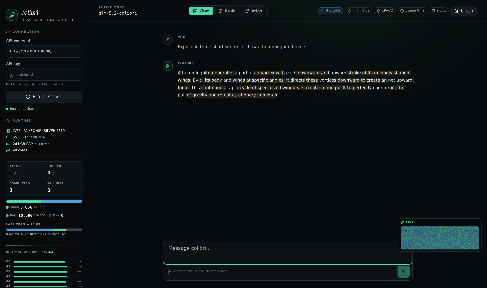
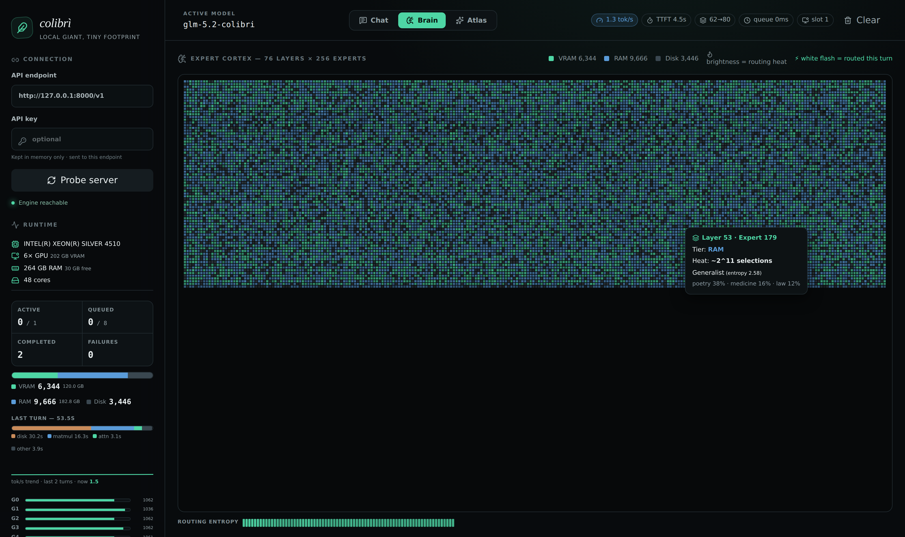
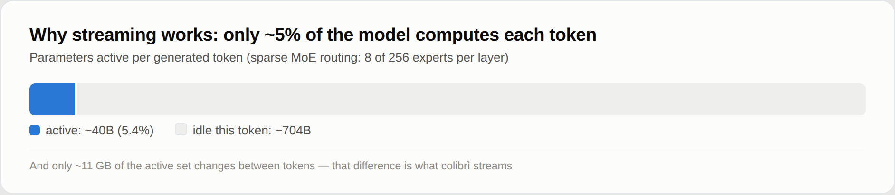
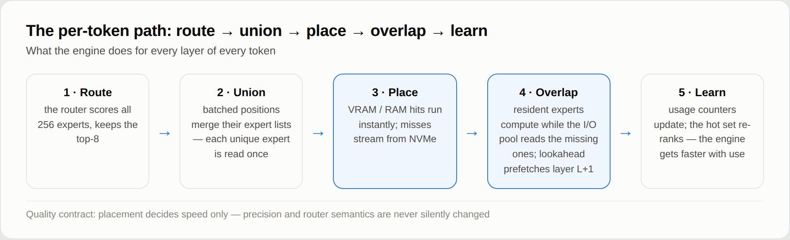
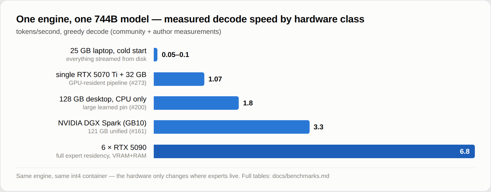

<p align="center">
  
</p>

<p align="center">
  <a href="https://github.com/JustVugg/colibri"></a>
  <a href="https://justvugg.github.io/colibri"></a>
  <a href="https://github.com/JustVugg/colibri/releases"></a>
</p>

<p align="center">
  <a href="https://justvugg.github.io/colibri"><b>Upstream website</b></a> ·
  English · <a href="README.zh-CN.md">简体中文</a> · <a href="README.zh-TW.md">繁體中文</a> · <a href="README.it.md">Italiano</a>
  <br><sub>The translated READMEs linked above are upstream's own docs and are not kept in sync with this fork's changes.</sub>
</p>

## This fork

**This is `dkurukula/colibri`, a persistent fork of [`JustVugg/colibri`](https://github.com/JustVugg/colibri) (the upstream project).** It is not a snapshot or a one-off patch set — it's maintained on an ongoing basis, tracking upstream and periodically reconciling with it, but built and tuned around **one specific, unglamorous machine**: a Dell PowerEdge R720 with two Intel Xeon E5-2660 v2 CPUs ("Ivy Bridge," no AVX2/FMA — old enough that upstream's default fast paths don't even compile for it), 125 GB of RAM, and a single consumer GPU, an NVIDIA GTX 1050 Ti with 4 GB of VRAM. That's the whole hardware budget this fork optimizes for — not the multi-GPU workstations upstream benchmarks on.

**Everything below this point in this file, except where explicitly marked otherwise, is upstream's own documentation** — upstream's engine description, upstream's vision, upstream's benchmark numbers (from upstream's own hardware, not this one), and upstream's roadmap. It's kept largely as-is because the underlying engine and its design are shared with upstream; this fork adds to and tunes that engine, it doesn't replace it. Sections with fork-specific content are called out explicitly; everything else should be read as "this is what the upstream maintainers say," not as a claim this fork is making about itself.

What this fork has actually added or changed, in its own voice:

- **Made the engine buildable on this hardware at all**: AVX-only kernel paths for Sandy/Ivy Bridge CPUs with no AVX2 or FMA — upstream's fast paths assume AVX2 is available; this box's CPUs don't have it.
- **`CUDA_MISS_GPU`**: GPU-accelerated compute for cache-miss routed experts during decode and prefill, streaming weights to the GPU on demand rather than computing every miss on the (slow, pre-AVX2) CPU.
- **An async, double-buffered dispatch pipeline** for that GPU-miss path — overlapping one expert's weight transfer with the previous expert's compute/readback via per-slot CUDA streams and pinned staging, instead of a fully serial round trip per miss.
- **A fixed-ratio CPU/GPU concurrent split for decode misses** (`COLI_MISS_CPU_EVERY`) — routing a tunable fraction of cache misses straight to CPU compute, running concurrently with GPU-issued misses, since this CPU turned out to be compute-bound rather than memory-bandwidth-bound and barely contends with concurrent PCIe transfer. The idea is adapted from a real paper, [**FreeToken** (Yang, Fan, et al., arXiv:2608.16157)](https://arxiv.org/abs/2608.16157), whose own bandwidth-adaptive formula assumes memory-bandwidth-bound CPU execution — an assumption re-checked against this specific hardware, not copied blindly. **Measured on this exact machine, live**: a real ~27% decode tok/s improvement over the GPU-only path (0.1231 → 0.1563 tok/s, real production traffic config, `cap=3`, single GTX 1050 Ti, one A/B run each — see the PR history for the full methodology and caveats).
- **Ported [ATSInfer](https://arxiv.org/abs/2607.10183)'s load-aware live re-pin gate** (Algorithm 3) — only re-pin an expert's placement when the deviation from a rolling throughput baseline is worth the disk cost, instead of re-pinning unconditionally.
- **Ops/reliability additions for running this as a persistent service on real hardware**: a decode liveness heartbeat (mirroring upstream's existing prefill one), a stall watchdog that detects a deadlocked engine that never actually errors, systemd deploy templates, and a live-usage watcher.
- **A podman quick-start path** alongside upstream's existing docker guide, and periodic reconciliation merges that pull in relevant upstream/dev fixes (e.g. an OMP grain-size guard and an autopin/LRU budget fix) as they land upstream.

For the general-purpose project — more hardware support, active development, the community benchmark table, releases — go to **[upstream, `JustVugg/colibri`](https://github.com/JustVugg/colibri)**. This fork exists because one specific old server needed the engine to run well on it, not to replace or compete with upstream.

---

**Tiny engine, immense model.** Run **GLM-5.2 (744B-parameter MoE)** on a consumer machine with ~25 GB of RAM — in pure C, with zero dependencies, by streaming experts from disk.

Colibrì is a lightweight, quality-preserving MoE runtime that treats VRAM, RAM,
and storage as one managed memory hierarchy. Insufficient fast memory may reduce
speed, but the default policy **never silently changes model precision or router
semantics**.

```
$ ./coli chat
  🐦 colibri v1.1.0 — GLM-5.2 · 744B MoE · int4 · streaming CPU
  ✓ ready in 32s · resident 9.9 GB
  › ciao!
  ◆ Ciao! 😊 Come posso aiutarti oggi?
```

## See it running

*The screenshots and numbers below are upstream's, captured on upstream's own hardware (a 6× RTX 5090 machine) — not this fork's R720.*

<p align="center">
  
</p>
<p align="center"><em>Upstream's web dashboard (<code>./coli web</code>): a 744B model at <strong>4 tok/s, TTFT 1.6 s, disk 0</strong> —
full expert residency on 6× RTX 5090, with live token metrics, the per-turn time breakdown,
the VRAM/RAM/disk tier bar and the live mini-brain in the corner.</em></p>

<p align="center">
  
</p>
<p align="center"><em>Upstream's <strong>Brain</strong> page: all 19,456 experts as a living cortex — colour is the storage tier,
brightness is routing heat, and every expert routed in a turn flashes white. Hovering shows the expert's
<a href="https://github.com/JustVugg/colibri/issues/175">measured topic affinity</a> (upstream issue).</em></p>

<p align="center">
  
</p>
<p align="center"><em>Upstream's <strong>Atlas</strong> page: the <a href="https://github.com/JustVugg/colibri/issues/175">measured expert atlas</a> (upstream issue)
as a 3-D galaxy — 13,260 characterised experts, 1,041 replicated specialists clustering by topic
(poetry, law, Chinese, SQL…). Position is measured routing affinity, not a learned embedding. Drag to spin.</em></p>

## The vision

*Upstream's own stated vision for the project:*

> Frontier models should not be sealed inside datacenters. colibrì exists so that
> **anyone curious enough can open one up**: run a 744B-parameter mind on hardware
> you already own, watch every expert fire in real time, and change the code that
> does it. Not renting intelligence behind an API — *holding* it: probing it,
> measuring it, improving it. Every optimisation in this project started with
> someone measuring something on their own machine; the engine is deliberately
> small enough that the next one can come from you.

This fork is, in a small way, exactly that: someone measuring something (an old R720's real throughput) and changing the code that does it.

## The idea

*The architecture description below is upstream's — it describes the shared engine this fork also runs, unmodified in concept.*

A 744B Mixture-of-Experts model activates only ~40B parameters per token — and
only ~11 GB of those change from token to token (the routed experts):

<p align="center">
  
</p>

So the model doesn't need to *fit* in fast memory — it needs to be **placed**:

- the **dense part** (attention, shared experts, embeddings — ~17B params) stays
  **resident in RAM at int4** (~9.9 GB);
- the **19,456 routed experts** (75 MoE layers × 256 + the MTP head, ~19 MB each
  at int4) live **on disk** (~370 GB) and are **streamed on demand**, with a
  per-layer LRU cache, a learned pinned hot-store, and an optional VRAM tier.

Think of the core algorithm as **a JIT, but for weights**. A compiler JIT never
compiles the whole program — it watches what actually runs and compiles the hot
paths, just in time. colibrì makes the same bet about a 744B parameter space:
parameters are not resident state to be held, they are **data to be staged**
across a heterogeneous storage hierarchy (VRAM / RAM / NVMe), exactly when the
router proves they are needed. Measured routing heat decides which experts earn
which tier, the router runs a layer ahead so prefetch hides the staging latency,
and — like a JIT — the engine learns your workload: the more you run, the hotter
the right experts get. It works because routing has measurable structure (see
upstream's [expert atlas](https://github.com/JustVugg/colibri/issues/175)) — and
structure is cacheable.

The engine is a single C file (`c/colibri.c`) plus small headers. No BLAS, no Python
at runtime, no GPU required (though this fork's hardware benefits a lot from one — see above).

## How it works

*This section is upstream's own writeup of the shared engine's design — accurate for this fork too, since it's the same codebase; the CUDA_MISS_GPU / async-pipeline / CPU-GPU-split work this fork added builds on top of the mechanisms described here rather than replacing them.*

### The per-token path

<p align="center">
  
</p>

Every layer of every token walks the same five steps. The design goal is that
**placement only ever decides speed** — the router's decisions and the weights'
precision are the same whether an expert answered from VRAM or from disk.

### One memory hierarchy instead of one memory requirement

<p align="center">
  
</p>

### Dual-SSD: two copies of the model, twice the read bandwidth

Decode is disk-bound on most machines, and expert reads are read-only — so if you have a **second SSD**, put a full copy of the model on it and let the engine stream from both drives at once:

```bash
COLI_MODEL=/fast/glm52_i4 COLI_MODEL_MIRROR=/second/glm52_i4 ./coli chat
COLI_DISK_WEIGHTS=9,3 ...   # optional: primary,mirror bandwidth ratio (else measured at startup)
```

Each expert is routed to one drive by a deterministic hash, weighted by the two drives' measured (or declared) bandwidth, so readahead/PILOT prefetch and the demand read always hit the same drive and nothing is cached twice. The aggregate bandwidth is the sum of both drives — a 9 GB/s + 3 GB/s pair reads experts ~33% faster than the fast drive alone, and the OMP-parallel pin/warmup load streams from both. Details worth knowing:

- the mirror is **validated at startup** (per-file size + safetensors header must be byte-identical to the primary); divergent or missing files silently stay on the primary, so a **partial mirror is fine** — a smaller second SSD holding only some shards still helps;
- the mirror is **never written**: `.coli_usage`, `.coli_kv` and all sidecars stay on the primary;
- a read error on the mirror falls back to the primary (one warning, no crash), so unplugging the second drive mid-run degrades instead of killing the server;
- routing never changes tokens — both copies are byte-identical, and the per-run `MIRROR:` stats line shows GB served per drive.

The same engine spans the whole range: on a 25 GB laptop everything streams from
disk (slow but correct); on a large host the entire expert set becomes resident
(`CUDA_EXPERT_GB=auto PIN_GB=all`) and disk drops out of the decode path
entirely. Between the tiers sits a **learning cache**: the engine records which
experts *your* workload routes to (`.coli_usage`, updated every turn) and pins
the hottest ones automatically — colibrì literally gets faster the more you use
it. On multi-socket hosts, `COLI_NUMA=1` interleaves the resident weights across
memory controllers ([upstream issue #82](https://github.com/JustVugg/colibri/issues/82)).

### Never wait for the disk twice

Misses are expensive, so the engine spends most of its cleverness avoiding and
overlapping them: each expert's three matrices are stored adjacent and read in
one `pread`; a bounded async I/O pool (`PIPE=1`, default) loads missing experts
while resident ones compute; batched positions read each unique expert once
(**batch-union**); and a router-lookahead thread (`PILOT=1`) prefetches the next
layer's experts — routing is measurably **71.6% predictable one layer ahead**.
On GPUs, the resident pipeline (`COLI_CUDA_PIPE=2`) keeps the residual stream
on-device across layers so the CPU expert loop runs uninterrupted (this fork's
`CUDA_MISS_GPU` and its async/CPU-split extensions, described above, cover the
*cache-miss* experts specifically — a gap this resident pipeline doesn't
address); on Apple Silicon an experimental [Metal backend](docs/metal.md) does
the batched expert math on the unified-memory GPU.

> **On real NVMe, measure `DIRECT=1`.** O_DIRECT bypasses the page cache and is
> often a large win on drives with DRAM cache and bandwidth headroom (+34%
> decode measured with `PIPE=1` on a Blackwell/Windows box; 4.25→9.69 GB/s in
> iobench on a GB10) — but it is drive-dependent: QLC/DRAM-less or virtualised
> disks can be neutral to negative. Try it first; keep what your hardware
> rewards. (Upstream's measurement, on upstream's hardware; this fork's NVMe is
> DRAM-less and virtualised, and buffered I/O measured better here — exactly the
> "drive-dependent" case this note warns about.)

### Faithful model, compressed state

The forward pass is validated **token-exact against a `transformers` oracle**
(teacher-forcing 32/32). MLA attention stores a compressed KV state — 576
floats/token instead of 32,768 (**57× smaller**) — and persists it across
restarts (`.coli_kv`): conversations reopen warm with zero re-prefill,
byte-identical to an uninterrupted session. DSA sparse attention (GLM-5.2's
lightning indexer) is implemented faithfully and validated by forcing full-key
selection to reproduce dense attention exactly.

### Speculative decoding, honestly

GLM-5.2's native MTP head drafts tokens that the main model verifies in one
batched forward — 2.2–2.8 tokens/forward when it pays. Two hard-won rules ship
as defaults: the MTP head must be **int8** (int4 heads collapse to 0–4%
acceptance, [upstream issue #8](https://github.com/JustVugg/colibri/issues/8)), and draft and
verify must compute **the same function** — `SPEC_PIN=1` pins both to one
kernel family ([upstream issue #163](https://github.com/JustVugg/colibri/issues/163) is the
full forensic story). Grammar-forced drafts
([`GRAMMAR=file.gbnf`](docs/grammar-draft.md)) add ~free acceptance on
constrained JSON output. Whether speculation is a net win depends on your
cache temperature — measure, and use `DRAFT=0` when it doesn't pay.

## What it achieves

*Every number below this line, up to the fork-specific paragraph, is upstream's — measured on upstream's own community hardware, none of it this fork's R720.*

<p align="center">
  
</p>

Same engine, same int4 container — the hardware only changes where the experts
live. Highlights from upstream's [full benchmark tables](docs/benchmarks.md):

- **6× RTX 5090, full residency:** 5.8–6.8 tok/s decode, TTFT ~13 s
  ([upstream experiment log](docs/experiments/glm52-6x5090-2026-07-12.md));
- **128 GB CPU-only desktop:** ~1.8 tok/s warm ([upstream issue #200](https://github.com/JustVugg/colibri/issues/200));
- **single RTX 5070 Ti laptop-class box:** 1.07 tok/s via the GPU-resident
  pipeline ([upstream issue #273](https://github.com/JustVugg/colibri/issues/273));
- **25 GB dev box:** 0.05–0.1 tok/s cold — the proven floor where upstream's
  project started, and still their honest baseline.

Quality is measured, not assumed: the int4 container's quantization cost and the
scale-granularity/rotation ablations live in
[docs/benchmarks.md](docs/benchmarks.md#quality-benchmark) and
[upstream issue #108](https://github.com/JustVugg/colibri/issues/108)/[#81](https://github.com/JustVugg/colibri/issues/81).

**This fork's actual number**, for comparison, honestly: on the R720 described
above (dual Ivy Bridge Xeon, 125 GB RAM, one GTX 1050 Ti) — decode measured at
**0.123 tok/s** with `CUDA_MISS_GPU` alone, **0.156 tok/s** with this fork's
CPU/GPU concurrent split also enabled (`COLI_MISS_CPU_EVERY`, real production
traffic config, `cap=3`). That sits close to upstream's own "25 GB dev box"
floor above, not their flagship numbers — this hardware is old and RAM/GPU-
constrained by upstream's standards, and that's the honest baseline this fork
measures itself against, not the 6-GPU numbers above.

## Get started

You need two things: **the program** (a few hundred KB) and **the model**
(372 GB). Step-by-step for every platform in upstream's
[Quick Start guide](docs/quickstart.md).

### 1. Get colibri

**Build from this fork** — needs `gcc` (or clang) with OpenMP:

```bash
git clone https://github.com/dkurukula/colibri && cd colibri/c
./setup.sh                                # checks gcc/OpenMP, builds, self-tests
```

This fork does not currently publish its own prebuilt binaries or tagged
releases — building from source is the supported path here. If you don't need
this fork's specific changes (see "This fork" above) and just want the
general-purpose engine, upstream publishes **prebuilt releases** for Linux,
macOS and Windows — no compiler needed. Take the archive for your platform from
[upstream's Releases](https://github.com/JustVugg/colibri/releases) and unpack it:

```bash
mkdir colibri && tar xzf colibri-v1.1.0-linux-x86_64.tar.gz -C colibri && cd colibri
python3 coli info                         # engine ready ✓
```

Inside you get the engine (`colibri`, `colibri.exe` on Windows), the `coli`
launcher and its Python helpers. Nothing to rename or configure — `coli` finds
the engine next to itself. You only need
[Python 3](https://www.python.org/downloads/) installed: the launcher and the
API gateway are Python scripts, while the engine itself is pure C with zero
dependencies.

Want `coli` on your PATH? From a checkout, `pip install -e .` registers it (the
engine still lives in `c/` — an editable install from the clone, not a wheel).

**Or run it in podman** — one script builds the image and runs the engine
inside it, no compiler needed on the host:

```bash
git clone https://github.com/dkurukula/colibri && cd colibri
COLI_MODEL=/nvme/glm52_i4 c/scripts/podman.sh chat
```

See [docs/podman.md](docs/podman.md) for tunables (`ARCH`, `RAM_GB`, `REPIN`,
`PORT`, …) and the `make podman-chat` / `make podman-serve` shortcuts. A manual
[`docker/`](docker/README.md) guide also ships with the project (from upstream).

### 2. Get the model

*This section is upstream's — the model source and conversion path are the same for this fork.*

A pre-converted **GLM-5.2 int4** container is on Hugging Face — **use the
version with the int8 MTP heads**. It is about **372 GB**, so put it on a disk
with the room, ideally a fast one:

**https://huggingface.co/mateogrgic/GLM-5.2-colibri-int4-with-int8-mtp**

> ⚠️ The original mirror ships int4 MTP heads → 0% draft acceptance
> ([upstream issue #8](https://github.com/JustVugg/colibri/issues/8)). Check yours:
> `ls -l <model>/out-mtp-*` — int8 (correct) is `3527131672 / 5366238584 / 1065950496`.

Or convert from the FP8 source yourself — one resumable command that never needs
the full 756 GB on disk at once:

```bash
./coli convert --model /nvme/glm52_i4     # download+convert shard by shard (python, one-time)
```

### 3. Run it

```bash
COLI_MODEL=/nvme/glm52_i4 ./coli chat     # RAM budget, cache and MTP auto-detected
COLI_MODEL=/nvme/glm52_i4 ./coli plan     # inspect the planned VRAM/RAM/disk placement
COLI_MODEL=/nvme/glm52_i4 ./coli doctor   # read-only readiness check
./coli web  --model /nvme/glm52_i4        # API + web dashboard on one port
./coli serve --model /nvme/glm52_i4       # OpenAI-compatible API only
```

On Windows the same commands work with `python coli chat --model D:\glm52_i4`.
The engine at runtime is pure C — python is only used by the one-time converter
and the optional API gateway.

This fork's own deployment runs as a systemd service inside podman, with
`CUDA_MISS_GPU=1` and `COLI_MISS_CPU_EVERY=2` set — see "This fork" above and
the deploy templates this fork added for the specifics.

### 4. Go deeper

*Links below are upstream's docs, describing the shared engine.*

| topic | doc |
|---|---|
| Benchmarks, community datapoints, quality measurements | [docs/benchmarks.md](docs/benchmarks.md) |
| Tuning knobs, policies, the learning cache, prefetch | [docs/tuning.md](docs/tuning.md) |
| Windows 11 native build (+ CUDA DLL) | [docs/windows.md](docs/windows.md) |
| CUDA backend, VRAM expert tier, full residency | [docs/cuda.md](docs/cuda.md) |
| Apple Silicon Metal backend | [docs/metal.md](docs/metal.md) |
| OpenAI-compatible API, KV slots, web dashboard | [docs/api.md](docs/api.md) |
| Grammar-forced drafts (structured output) | [docs/grammar-draft.md](docs/grammar-draft.md) |
| Environment variable inventory | [docs/ENVIRONMENT.md](docs/ENVIRONMENT.md) |
| Running colibrì in podman | [docs/podman.md](docs/podman.md) |

## What's next

*Upstream's own stated roadmap:*

> - **Algorithmic research is active.** The current hierarchy is LRU + a learned
>   pin set; the next step is under way — smarter placement and scheduling,
>   overlap of CPU and GPU expert execution, and routing-aware speculation.
>   Everything lands the way this project always works: measured, reviewed, and
>   merged in the open.
> - **More open models.** The tiering algorithm is model-agnostic: any MoE with
>   routed experts can be staged the same way. GLM-5.2 and OLMoE run today;
>   support for more open-weight families — **Kimi K2** (Moonshot AI),
>   **Qwen3 MoE** (Alibaba), **MiniMax** — is on the roadmap.

Worth noting: "overlap of CPU and GPU expert execution" is exactly what this
fork's `COLI_MISS_CPU_EVERY` work above does, built independently for this
hardware before checking whether upstream had already scoped the same idea.
Reconciling the two is a natural next step for this fork, not done yet.

## Supporting the project

*Upstream's own message to their community:*

> colibrì started as a one-person project on a 12-core laptop with 25 GB of RAM;
> today its numbers come from a community of real machines. If it's useful to you:
>
> - ⭐ star the repo and share it;
> - 🐛 open issues with benchmark numbers from your hardware — datapoints move
>   this project more than anything else;
> - 💬 reach out via GitHub issues to sponsor development or donate hardware.

That's [upstream's repo](https://github.com/JustVugg/colibri) to star and their issue
tracker for benchmark reports — this fork is one of the "community of real
machines" they're describing.

## Repo layout

```
Makefile                  root build/check entry point
c/
├── colibri.c             single-file engine
├── st.h, tok.h, json.h   runtime headers
├── backend_cuda.*        optional CUDA tier
├── Makefile              build and local checks
├── coli                  user-facing CLI
├── openai_server.py      OpenAI-compatible HTTP gateway
├── setup.sh              one-command local setup
├── tools/                offline conversion, fixtures and benchmarks
├── scripts/              long-running conversion helpers
└── tests/                dependency-free C and Python tests
web/                      browser UI (pure OpenAI-API client)
desktop/                  Tauri v2 desktop shell wrapping the web UI
docs/                     reference docs, experiments, media
```

The runtime path intentionally stays flat and readable: `colibri.c` plus its small
headers. From the repository root, `make`, `make check`, and `make clean`
delegate to the engine Makefile.

## Why "colibrì"

*Upstream's own naming rationale:*

> The hummingbird weighs a few grams, hovers in place, and visits a thousand
> flowers a day. This engine keeps a 744-billion-parameter giant alive on
> hummingbird rations: 25 GB of RAM, twelve CPU cores, and a lot of disk patience.

This fork's rations are different — 125 GB of RAM, forty older cores, and one
small GPU — but the same idea: a giant, kept alive on what's actually on hand.

## Acknowledgements

*Upstream's own acknowledgements:*

> colibrì is an engine; the minds it runs are a gift. Thank you to the teams
> releasing frontier-class weights in the open — **Z.ai** (GLM), **Moonshot AI**
> (Kimi), **Alibaba Qwen**, **MiniMax**, and **Allen AI** (OLMoE) — and to every
> contributor who benchmarked, bisected, replicated an atlas run, or sent a patch.
> This project is proof of what open weights make possible.

This fork's own thanks: to upstream, `JustVugg/colibri`, for the engine this
fork builds on — none of the hardware-specific work above would exist without
it.

## License

Apache 2.0. GLM-5.2 weights are released by Z.ai under MIT.
